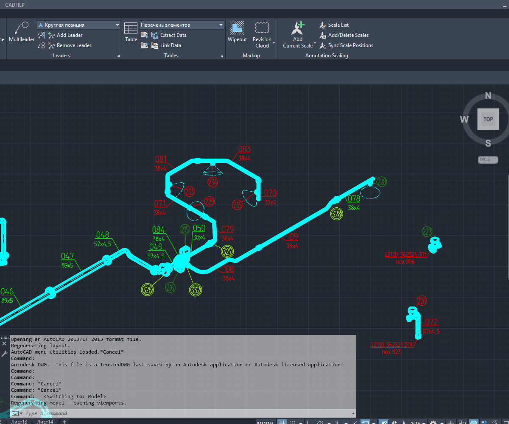

# 📐 AutoCAD AutoLISP — MLeaderSmartAlign

**Smart alignment of AutoCAD `MULTILEADER` objects with live preview and geometry-aware ordering to reduce crossing leader lines.**

🇷🇺 **Русская версия**  
🇬🇧 [English version](#-english-version)

---

## 🎞 MLEADERALIGN vs MLeaderSmartAlign

> В демонстрации сначала показан результат штатной команды `MLEADERALIGN`, затем — работа `MLeaderSmartAlign_v05.lsp`.

[](images/example.gif)

➡️ [Открыть GIF в полном размере](images/example.gif)

---

## 📦 Скачать

➡️ **[MLeaderSmartAlign v0.5 — скачать MLeaderSmartAlign_v05.lsp](https://github.com/ivashinpavel07/AutoCAD-AutoLISP-MLeaderSmartAlign/releases/download/v0.5/MLeaderSmartAlign_v05.lsp)**

[Все релизы](https://github.com/ivashinpavel07/AutoCAD-AutoLISP-MLeaderSmartAlign/releases)

---

# 🇷🇺 Русская версия

## 🧩 О проекте

Штатная команда AutoCAD `MLEADERALIGN` умеет выравнивать и распределять содержимое мультивыносок, но на сложных чертежах этого бывает недостаточно.

Если просто расставить большое количество MLeader вдоль одной линии, сами подписи могут оказаться расположены аккуратно, а линии-указатели — пересечься между собой. Причина в том, что для хорошего результата важно учитывать не только будущие позиции текста или блоков, но и геометрию точек, к которым привязаны стрелки.

**MLeaderSmartAlign** — AutoLISP-команда для AutoCAD, которая добавляет такой анализ.

Команда не просто распределяет MLeader с одинаковым шагом. Для **каждой очередной позиции** она заново анализирует **все ещё не размещённые MLeader**, выбирает наиболее подходящий по геометрии указателя, размещает его и только после этого переходит к следующей позиции.

Именно этот итерационный принцип помогает существенно уменьшить количество перекрёстных Leaders.

> 💡 Алгоритм не выполняет прямую проверку пересечения каждой пары сегментов Leader. Он уменьшает пересечения за счёт согласования порядка MLeader с расположением их arrowhead / anchor points.

---

## 🚀 Возможности v0.5

`MLeaderSmartAlign_v05.lsp` поддерживает:

- 📐 интеллектуальное выравнивание нескольких `MULTILEADER`;
- 🔄 повторный пересчёт геометрии после размещения каждого MLeader;
- ↔️ равномерное распределение по направлению, заданному пользователем;
- 👀 **Live Preview** до фиксации результата;
- 🖱 динамическое изменение направления движением мыши;
- ↩️ отмену preview по `Esc` с восстановлением исходной геометрии;
- 📍 сохранение исходных точек стрелок на геометрии чертежа;
- ⭕ выравнивание блочного содержимого по его позиции/центру;
- 📝 выравнивание MText по горизонтальному центру текста с сохранением уровня landing;
- 🛟 fallback на точку landing, если тип содержимого не удалось определить;
- 🧪 команду `MSADEBUG` для диагностики геометрии MLeader.

---

## 🆚 Почему не просто MLEADERALIGN?

Обычное выравнивание решает в первую очередь задачу расположения содержимого:

```text
[Text 1]   [Text 2]   [Text 3]   [Text 4]
```

Но если точки стрелок находятся в другом пространственном порядке, Leader Lines могут пересекаться:

```text
Anchor A ───────────────╲
Anchor B ────────╲       ╲
Anchor C ────╲    ╲       ╲
Anchor D ─╲    ╲    ╲       ╲
```

`MLeaderSmartAlign` на каждой позиции заново решает вопрос:

> **Какой из оставшихся MLeader лучше поставить сюда с учётом положения его стрелки?**

Поэтому порядок подписей формируется не случайно и не только по их исходным координатам.

---

# ⚙️ Как пользоваться

## 1️⃣ Загрузите LISP

В AutoCAD выполните:

```text
APPLOAD
```

и загрузите:

```text
MLeaderSmartAlign_v05.lsp
```

---

## 2️⃣ Запустите команду

Основная команда:

```text
MLEADERSMARTALIGN
```

Короткие варианты:

```text
MSA
MSA5
```

---

## 3️⃣ Выберите MLeader

Выберите необходимые объекты `MULTILEADER` и подтвердите выбор.

---

## 4️⃣ Укажите начало выравнивания

Команда запросит:

```text
Specify alignment start point:
```

Укажите первую точку будущего ряда.

---

## 5️⃣ Задайте направление

После этого двигайте курсор.

Команда показывает **Live Preview** будущего результата:

```text
Specify direction: move cursor for live preview, click to accept <Esc to cancel>:
```

- движение мыши — пересчёт и обновление preview;
- ЛКМ — зафиксировать результат;
- `Esc` — отменить операцию и восстановить исходные MLeader.

---

# 🧠 Как работает алгоритм

## 📏 1. Расчёт точек размещения

Пусть выбрано `N` MLeader.

Вектор между начальной точкой и текущей точкой направления делится на:

```text
N + 1
```

равных интервалов.

Поэтому MLeader занимают внутренние точки:

```text
START   ○   ○   ○   ○   END
```

а не сами крайние точки.

---

## 📍 2. Получение геометрии MLeader

Для каждого `MULTILEADER` команда через AutoCAD ActiveX / Visual LISP получает вершины Leader Lines и сохраняет исходную геометрию.

Для выбора порядка используется репрезентативная точка стрелки. Если у MLeader несколько Leader Lines, их arrowhead points объединяются в одну расчётную точку.

---

## 📐 3. Пересчёт углов для текущей позиции

Для очередной целевой точки строится вектор:

```text
Current Target → Arrow Point
```

Он сравнивается с направлением линии выравнивания.

Для **всех оставшихся MLeader** вычисляется угловая оценка.

---

## 🔄 4. Выбор одного MLeader

Для текущей позиции выбирается MLeader с наиболее подходящим углом.

После этого он:

1. переносится в текущую точку;
2. исключается из списка кандидатов;
3. его arrowhead points возвращаются в исходные координаты;
4. алгоритм переходит к следующей позиции.

---

## ♻️ 5. Всё рассчитывается заново

Это ключевая часть алгоритма.

После размещения одного MLeader порядок оставшихся **не считается заранее фиксированным**.

Для следующей позиции команда снова проверяет все оставшиеся элементы:

```text
N кандидатов
↓
выбран 1
↓
N - 1 кандидатов
↓
выбран 1
↓
N - 2 кандидатов
↓
...
```

Для 79 MLeader это означает последовательные расчёты:

```text
79 + 78 + 77 + ... + 1
```

Именно такой подход оказался значительно устойчивее простой одноразовой сортировки.

---

# 👀 Live Preview

Начиная с v0.3 команда поддерживает динамическое preview.

Во время движения курсора алгоритм полностью пересчитывает будущий порядок MLeader и показывает реальное положение объектов до подтверждения.

Для больших выборок частота обновления preview автоматически ограничивается, чтобы сохранить приемлемую отзывчивость интерфейса.

При `Esc` исходные вершины Leader Lines восстанавливаются.

---

# 📝 Выравнивание разных типов содержимого

## Блоки / круглые позиции

Для блочного содержимого используется позиция блока, поэтому круглые позиции визуально распределяются по центрам.

## MText на полке

Для текста недостаточно использовать конец landing — тексты разной ширины тогда выглядят распределёнными неравномерно.

В v0.5 используется:

**горизонтальный центр MText, спроецированный на линию landing.**

Это позволяет одновременно:

- равномерно распределить подписи по ширине;
- сохранить правильное положение текста относительно полки;
- визуально совместить текстовые и круглые обозначения в одном ряду.

---

# 🧬 Откуда появился алгоритм

Идея MLeaderSmartAlign выросла из более раннего VBA-проекта для **CATIA V5 Drafting**:

### 📐 CATIA V5 VBA — Align Balloons

GitHub:  
https://github.com/ivashinpavel07/CATIA-V5-VBA-Align-Balloons

Видео:  
https://www.youtube.com/watch?v=UVtbpVKDkvY

В CATIA использовался тот же основной принцип: для каждой новой позиции заново анализировать оставшиеся Balloons и выбирать следующий элемент по геометрии Leader.

Позже эта идея была перенесена на AutoCAD и дополнена:

- работой с `MULTILEADER` через ActiveX;
- сохранением исходных arrowhead points;
- динамическим Live Preview;
- отдельной логикой для MText и блочного содержимого.

---

# 🧱 Структура репозитория

```text
AutoCAD-AutoLISP-MLeaderSmartAlign/
│
├── MLeaderSmartAlign_v05.lsp
├── README.md
├── CHANGELOG.md
├── LICENSE
│
└── images/
    └── example.gif
```

---

# 🛠 Команды

| Команда | Назначение |
|---|---|
| `MLEADERSMARTALIGN` | Основная команда v0.5 |
| `MSA` | Короткий alias v0.5 |
| `MSA5` | Явный запуск v0.5 |
| `MSA4` | Предыдущий режим с полным центром содержимого |
| `MSA3` | Стабильный режим v0.3 по landing point |
| `MSA2` | Статический двухточечный режим без Live Preview |
| `MSADEBUG` | Диагностика геометрии одного MLeader |

---

# ⚠️ Ограничения

Текущая версия имеет несколько сознательных ограничений:

- прямой тест пересечения каждой пары Leader-сегментов пока не выполняется;
- при нескольких Leader Lines для выбора порядка используется усреднённая репрезентативная arrow point;
- Live Preview основан на `grread` и не воспроизводит полностью все возможности штатного AutoCAD tracking, OSNAP, Polar и Ortho во время динамической стадии;
- алгоритм ориентирован на AutoCAD for Windows с Visual LISP / ActiveX;
- на очень больших выборках preview обновляется с адаптивным ограничением частоты.

---

# 💡 Возможное развитие

В дальнейшем можно добавить:

- прямой геометрический анализ пересечений Leader Lines;
- дополнительную оптимизацию длины Leaders;
- фиксированный пользовательский шаг;
- выравнивание по выбранной Line / Polyline;
- дополнительные режимы направления;
- отдельную обработку MLeader с несколькими стрелками.

---

# 📄 Лицензия

MIT License.

---

# 🇬🇧 English version

## 🧩 About

The standard AutoCAD `MLEADERALIGN` command can align and distribute multileader content, but on complex drawings that is often not enough.

When many MLeaders are placed along one alignment line, the annotation content may look organized while the leader lines cross each other. A better result requires taking the arrowhead / anchor geometry into account when deciding **which annotation should occupy each target position**.

**MLeaderSmartAlign** is an AutoLISP command that adds this geometry-aware ordering.

Instead of sorting all annotations only once, the command recalculates the geometry for **every target position** and evaluates **all remaining MLeaders** before selecting the next one.

This iterative approach can significantly reduce crossing leader lines.

> 💡 The current algorithm does not perform an explicit intersection test between every pair of leader segments. Crossings are reduced by matching MLeader order to arrowhead geometry.

---

## 🚀 Features in v0.5

- smart alignment of multiple `MULTILEADER` objects;
- iterative angle recalculation after every placed MLeader;
- equal spacing along a user-defined direction;
- **Live Preview** before accepting the result;
- dynamic direction controlled by mouse movement;
- `Esc` cancellation with original geometry restoration;
- original arrowhead locations remain attached to drawing geometry;
- block/circular callouts aligned by their content position / center;
- MText aligned by its horizontal center projected onto the landing line;
- landing-point fallback when content geometry cannot be resolved;
- `MSADEBUG` command for MLeader geometry diagnostics.

---

# ⚙️ Usage

1. Run `APPLOAD`.
2. Load `MLeaderSmartAlign_v05.lsp`.
3. Run:

```text
MLEADERSMARTALIGN
```

or:

```text
MSA
MSA5
```

4. Select the required `MULTILEADER` objects.
5. Specify the alignment start point.
6. Move the cursor to define direction and distance.
7. Inspect the **Live Preview**.
8. Left-click to accept or press `Esc` to cancel.

---

# 🧠 Algorithm

For `N` selected MLeaders, the current alignment vector is divided into `N + 1` equal intervals.

For each target position:

1. the vector `Target Point → Arrow Point` is calculated for every remaining MLeader;
2. its angle relative to the alignment direction is evaluated;
3. the best candidate is selected;
4. that MLeader is placed at the current target;
5. it is removed from the candidate set;
6. its original arrowhead geometry is restored;
7. the next target position is processed;
8. **all angles are recalculated again for all remaining MLeaders**.

The order is therefore not predetermined.

For 79 MLeaders the selection logic performs the equivalent of:

```text
79 + 78 + 77 + ... + 1
```

candidate evaluations across the placement sequence.

---

# 👀 Live Preview

Live Preview was introduced in v0.3.

While the cursor moves, the complete iterative placement is recalculated and the actual MLeader objects are temporarily shown in their predicted positions.

Large selections use adaptive preview throttling to keep interaction responsive.

Pressing `Esc` restores the original Leader Line geometry.

---

# 📝 Content-aware alignment

## Block / circular callouts

Block content uses its content position, which usually corresponds to the visual center of a circular position marker.

## MText on a landing

Using the landing endpoint alone produces uneven spacing when text widths differ.

Version v0.5 uses the:

**horizontal center of the MText projected onto the landing line.**

This preserves the correct vertical attachment to the landing while producing more even visual spacing.

---

# 🧬 Origin of the idea

MLeaderSmartAlign is based on an earlier VBA project for **CATIA V5 Drafting**:

### 📐 CATIA V5 VBA — Align Balloons

GitHub:  
https://github.com/ivashinpavel07/CATIA-V5-VBA-Align-Balloons

YouTube:  
https://www.youtube.com/watch?v=UVtbpVKDkvY

The CATIA version already used the key concept: after placing one Balloon, recalculate the geometry of all remaining annotations before choosing the next one.

The AutoCAD version extends that idea with ActiveX MLeader geometry access, preserved arrowhead locations, Live Preview and content-aware alignment.

---

# ⚠️ Current limitations

- no explicit geometric intersection test between every pair of leader segments;
- multiple Leader Lines are represented by an averaged arrow point for ordering purposes;
- the `grread` Live Preview stage does not reproduce every native AutoCAD OSNAP / Polar / Ortho tracking feature;
- intended for AutoCAD for Windows with Visual LISP / ActiveX;
- very large selections use adaptive preview throttling.

---

# 📄 License

MIT License.
