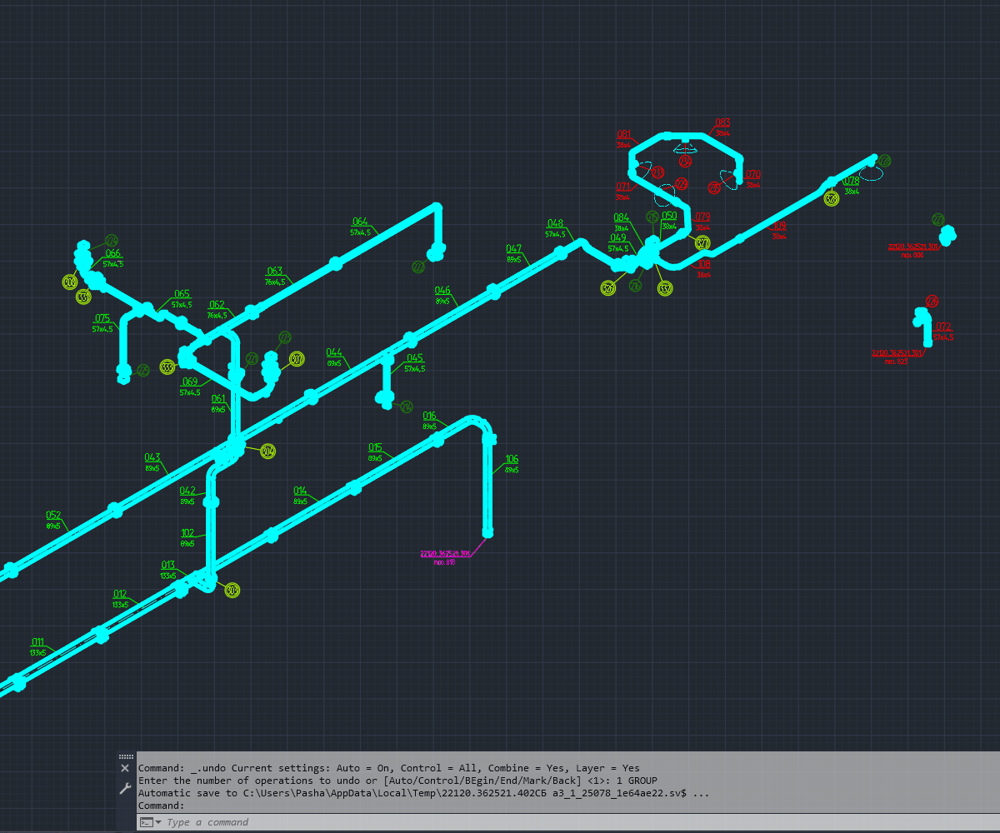

# 📐 AutoCAD AutoLISP — MLeaderSmartAlign

Smart alignment of AutoCAD `MULTILEADER` objects with live preview, geometry-aware ordering and perimeter distribution.

🇷🇺 [Русская версия](#-русская-версия)  
🇬🇧 [English version](#-english-version)

---

## 🎞 Demo

### MLEADERALIGN vs MLeaderSmartAlign

[](images/example.gif)

### MLeaderSmartAlign Perimeter

[](images/MLeaderSmartAlign_Perimeter.gif)

---

## 📦 Files

- `MLeaderSmartAlign_v05.lsp` — smart alignment along one line with Live Preview.
- `MLeaderSmartAlign_Perimeter_v01_fix1.lsp` — automatic distribution around a parallelogram perimeter.

> `MLeaderSmartAlign_Perimeter_v01_fix1.lsp` uses functions from `MLeaderSmartAlign_v05.lsp`, so load `MLeaderSmartAlign_v05.lsp` first.

---

# 🇷🇺 Русская версия

## 🧩 О проекте

Штатная команда AutoCAD `MLEADERALIGN` умеет выравнивать и распределять содержимое мультивыносок, но на сложных чертежах этого бывает недостаточно.

Если просто расставить большое количество MLeader вдоль одной линии, сами подписи могут выглядеть аккуратно, а линии-указатели — пересекаться между собой.

`MLeaderSmartAlign` добавляет геометрический анализ: для каждой очередной позиции алгоритм заново анализирует все ещё не размещённые MLeader, выбирает наиболее подходящий по положению стрелки и только после этого переходит к следующей позиции.

> Алгоритм не выполняет прямую проверку пересечения каждой пары Leader-сегментов. Пересечения уменьшаются за счёт согласования порядка MLeader с расположением их arrowhead / anchor points.

---

## 🚀 MLeaderSmartAlign v0.5

Файл:

`MLeaderSmartAlign_v05.lsp`

Основная задача — интеллектуальное выравнивание MLeader вдоль одной пользовательской линии.

### Возможности

- интеллектуальное выравнивание нескольких `MULTILEADER`;
- повторный пересчёт геометрии после размещения каждого MLeader;
- равномерное распределение по направлению пользователя;
- Live Preview до фиксации результата;
- динамическое изменение направления движением мыши;
- отмена по `Esc` с восстановлением исходной геометрии;
- сохранение исходных arrowhead points;
- выравнивание блочного содержимого по позиции / центру;
- MText выравнивается по горизонтальному центру текста с сохранением уровня landing;
- fallback на landing point, если тип содержимого не удалось определить;
- диагностическая команда `MSADEBUG`.

### Команды

```text
MLEADERSMARTALIGN
MSA
MSA5
MSA4
MSA3
MSA2
MSADEBUG
```

---

## 👀 Как пользоваться MLeaderSmartAlign

1. Выполните `APPLOAD`.
2. Загрузите `MLeaderSmartAlign_v05.lsp`.
3. Запустите `MLEADERSMARTALIGN`, `MSA` или `MSA5`.
4. Выберите нужные `MULTILEADER`.
5. Укажите начало линии выравнивания.
6. Двигайте курсор — команда показывает Live Preview.
7. ЛКМ — принять результат.
8. `Esc` — отменить и восстановить исходную геометрию.

---

## 🧠 Алгоритм SmartAlign

Для `N` выбранных MLeader текущий вектор выравнивания делится на:

```text
N + 1
```

равных интервалов.

Для каждой очередной Target Point:

1. рассчитывается вектор `Target Point → Arrow Point`;
2. оценивается угол относительно направления линии;
3. проверяются все оставшиеся MLeader;
4. выбирается один кандидат;
5. он перемещается в текущую позицию;
6. его arrowhead geometry возвращается в исходную точку;
7. выбранный MLeader исключается из списка;
8. для следующей позиции расчёт выполняется заново.

Порядок не фиксируется один раз заранее:

```text
N кандидатов
↓
выбран 1
↓
N - 1 кандидатов
↓
выбран 1
↓
N - 2 кандидатов
↓
...
```

---

# 🔲 MLeaderSmartAlign Perimeter v0.1

Файл:

`MLeaderSmartAlign_Perimeter_v01_fix1.lsp`

Команды:

```text
MSAP
MLeaderSmartAlignPerimeter
```

Этот режим предназначен для быстрого распределения большого количества MLeader вокруг сложного сборочного или изометрического вида.

Вместо одной линии используется параллелограмм, который задаётся всего тремя точками.

---

## 🎞 Демонстрация Perimeter

[](images/MLeaderSmartAlign_Perimeter.gif)

➡️ [Открыть GIF в полном размере](images/MLeaderSmartAlign_Perimeter.gif)

---

## 📐 Как работает Perimeter

Пользователь задаёт:

```text
P1 → P2 → P3
```

Четвёртая вершина вычисляется автоматически:

```text
P4 = P1 + (P3 - P2)
```

Две диагонали делят параллелограмм на четыре треугольные области.

Каждый MLeader классифицируется по исходной representative Arrow Point:

```text
P1-P2-C → сторона P1-P2
P2-P3-C → сторона P2-P3
P3-P4-C → сторона P3-P4
P4-P1-C → сторона P4-P1
```

Если Arrow Point находится на границе или за пределами параллелограмма, MLeader назначается ближайшей стороне.

---

## 🔄 Как MLeader размещаются по сторонам

После разделения на четыре группы каждая сторона обрабатывается отдельно тем же SmartAlign-алгоритмом:

```text
N → выбрать → переместить
N-1 → пересчитать → выбрать следующий
N-2 → пересчитать снова
...
1
```

MLeader размещаются по периметру в направлении:

```text
P1 → P2 → P3 → P4 → P1
```

При каждом перемещении исходная arrowhead geometry сохраняется.

---

## 🖱 Workflow Perimeter

1. Загрузите `MLeaderSmartAlign_v05.lsp`.
2. Загрузите `MLeaderSmartAlign_Perimeter_v01_fix1.lsp`.
3. Запустите `MSAP`.
4. Выберите `MULTILEADER`.
5. Укажите `P1`.
6. Двигайте курсор и задайте первую сторону `P1 → P2`.
7. ЛКМ фиксирует `P2`.
8. Из `P2` сразу начинается построение второй стороны.
9. Укажите `P3`.
10. `P4` рассчитывается автоматически.
11. Появляется временный пунктирный параллелограмм с двумя диагоналями.
12. MLeader распределяются по четырём областям.
13. Каждая группа пошагово выстраивается по своей стороне.
14. Временная геометрия исчезает после завершения команды.

---

## 🆚 Когда использовать какой режим

| Задача | Команда |
|---|---|
| Выстроить MLeader вдоль одной линии | `MSA` |
| Интерактивно менять направление с Live Preview | `MSA` / `MLEADERSMARTALIGN` |
| Быстро распределить MLeader вокруг вида | `MSAP` |
| Разложить MLeader сразу по четырём сторонам | `MLeaderSmartAlignPerimeter` |

---

## 📝 Content-aware alignment

### Block / круглые позиции

Для блочного содержимого используется позиция блока, которая обычно соответствует визуальному центру круглой позиции.

### MText на landing

В v0.5 используется горизонтальный центр MText, спроецированный на landing line.

Это позволяет равномернее распределять подписи разной ширины и сохранять правильный уровень полки.

---

## 🧬 Откуда появился алгоритм

Идея MLeaderSmartAlign выросла из более раннего VBA-проекта для CATIA V5 Drafting:

GitHub:  
https://github.com/ivashinpavel07/CATIA-V5-VBA-Align-Balloons

YouTube:  
https://www.youtube.com/watch?v=UVtbpVKDkvY

В CATIA использовался тот же основной принцип: после размещения одного Balloon заново анализировать геометрию всех оставшихся элементов перед выбором следующего.

Позже идея была перенесена в AutoCAD и дополнена ActiveX-доступом к `MULTILEADER`, сохранением arrowhead points, Live Preview, отдельной логикой для MText и блоков и новым режимом Perimeter.

---

## 🧱 Структура репозитория

```text
AutoCAD-AutoLISP-MLeaderSmartAlign/
│
├── MLeaderSmartAlign_v05.lsp
├── MLeaderSmartAlign_Perimeter_v01_fix1.lsp
├── README.md
├── CHANGELOG.md
├── RELEASE_NOTES_v0.5.md
├── LICENSE
│
└── images/
    ├── example.gif
    └── MLeaderSmartAlign_Perimeter.gif
```

---

## 🛠 Команды

| Команда | Назначение |
|---|---|
| `MLEADERSMARTALIGN` | Основная команда SmartAlign v0.5 |
| `MSA` | Короткий alias SmartAlign v0.5 |
| `MSA5` | Явный запуск v0.5 |
| `MSA4` | Предыдущий режим с полным центром содержимого |
| `MSA3` | Режим v0.3 по landing point |
| `MSA2` | Статический двухточечный режим |
| `MSADEBUG` | Диагностика геометрии MLeader |
| `MSAP` | SmartAlign по периметру параллелограмма |
| `MLeaderSmartAlignPerimeter` | Полное имя команды Perimeter |

---

## ⚠️ Ограничения

- прямой тест пересечения каждой пары Leader-сегментов не выполняется;
- при нескольких Leader Lines для выбора порядка используется representative / averaged arrow point;
- Live Preview на `grread` не воспроизводит все штатные возможности OSNAP / Polar / Ortho;
- решение рассчитано на AutoCAD for Windows с Visual LISP / ActiveX;
- Perimeter использует функции из `MLeaderSmartAlign_v05.lsp`;
- очень сложная геометрия может потребовать ручной корректировки.

---

## 📄 Лицензия

MIT License.

---

# 🇬🇧 English version

## 🧩 About

The standard AutoCAD `MLEADERALIGN` command can align and distribute multileader content, but on complex drawings that is often not enough.

When many MLeaders are placed along one alignment line, the annotation content may look organized while Leader Lines still cross each other.

`MLeaderSmartAlign` adds geometry-aware ordering. For every target position, it evaluates all remaining MLeaders again, selects the best candidate according to the arrow geometry, places it, and only then proceeds to the next target.

> The current algorithm does not explicitly test every pair of Leader segments for intersection. Crossings are reduced by matching MLeader order to arrowhead / anchor geometry.

---

## 🚀 MLeaderSmartAlign v0.5

File:

`MLeaderSmartAlign_v05.lsp`

Main purpose: smart alignment of MLeaders along one user-defined direction.

### Features

- smart alignment of multiple `MULTILEADER` objects;
- iterative recalculation after every placed MLeader;
- equal spacing along a user-defined direction;
- Live Preview before accepting the result;
- dynamic mouse-controlled direction;
- `Esc` cancellation with original geometry restoration;
- preservation of original arrowhead points;
- block / circular content aligned by content position / center;
- MText aligned by horizontal text center projected onto the landing line;
- landing-point fallback when content geometry cannot be resolved;
- `MSADEBUG` diagnostic command.

### Commands

```text
MLEADERSMARTALIGN
MSA
MSA5
MSA4
MSA3
MSA2
MSADEBUG
```

---

## 👀 How to use MLeaderSmartAlign

1. Run `APPLOAD`.
2. Load `MLeaderSmartAlign_v05.lsp`.
3. Run `MLEADERSMARTALIGN`, `MSA` or `MSA5`.
4. Select the required `MULTILEADER` objects.
5. Specify the alignment start point.
6. Move the cursor to inspect the Live Preview.
7. Left-click to accept.
8. Press `Esc` to cancel and restore the original geometry.

---

## 🧠 SmartAlign algorithm

For `N` selected MLeaders, the alignment vector is divided into:

```text
N + 1
```

equal intervals.

For every target position:

1. calculate `Target Point → Arrow Point`;
2. evaluate the angle relative to the alignment direction;
3. evaluate every remaining MLeader;
4. select one candidate;
5. move it to the current target;
6. restore its original arrowhead geometry;
7. remove it from the candidate set;
8. recalculate everything for the next target.

The ordering is therefore not predetermined:

```text
N candidates
↓
select 1
↓
N - 1 candidates
↓
select 1
↓
N - 2 candidates
↓
...
```

---

# 🔲 MLeaderSmartAlign Perimeter v0.1

File:

`MLeaderSmartAlign_Perimeter_v01_fix1.lsp`

Commands:

```text
MSAP
MLeaderSmartAlignPerimeter
```

This mode is intended for quickly distributing many MLeaders around a complex assembly or isometric view.

Instead of one alignment line, it uses a parallelogram defined by only three user-picked points.

---

## 🎞 Perimeter demo

[](images/MLeaderSmartAlign_Perimeter.gif)

➡️ [Open GIF full size](images/MLeaderSmartAlign_Perimeter.gif)

---

## 📐 How Perimeter works

The user defines:

```text
P1 → P2 → P3
```

The fourth point is calculated automatically:

```text
P4 = P1 + (P3 - P2)
```

The two diagonals divide the parallelogram into four triangular regions.

Each MLeader is classified using its original representative Arrow Point:

```text
P1-P2-C → side P1-P2
P2-P3-C → side P2-P3
P3-P4-C → side P3-P4
P4-P1-C → side P4-P1
```

If an Arrow Point lies on a boundary or outside the parallelogram, the MLeader is assigned to the nearest perimeter side.

---

## 🔄 Placement around the perimeter

After classification, each side group is processed independently using the same proven SmartAlign algorithm:

```text
N → select → move
N-1 → recalculate → select next
N-2 → recalculate again
...
1
```

The perimeter direction is:

```text
P1 → P2 → P3 → P4 → P1
```

Original arrowhead geometry remains attached to the drawing geometry after every move.

---

## 🖱 Perimeter workflow

1. Load `MLeaderSmartAlign_v05.lsp`.
2. Load `MLeaderSmartAlign_Perimeter_v01_fix1.lsp`.
3. Run `MSAP`.
4. Select `MULTILEADER` objects.
5. Pick `P1`.
6. Move the cursor and define side `P1 → P2`.
7. Left-click to fix `P2`.
8. The second side starts immediately from `P2`.
9. Pick `P3`.
10. `P4` is calculated automatically.
11. A temporary dashed parallelogram with two diagonals is displayed.
12. MLeaders are divided into four groups.
13. Each group is placed step by step along its corresponding side.
14. The temporary geometry disappears when the command is complete.

---

## 🆚 Which mode should I use?

| Task | Command |
|---|---|
| Align MLeaders along one line | `MSA` |
| Change alignment direction interactively with Live Preview | `MSA` / `MLEADERSMARTALIGN` |
| Distribute MLeaders around a drawing view | `MSAP` |
| Place MLeaders on all four sides | `MLeaderSmartAlignPerimeter` |

---

## 📝 Content-aware alignment

Block content uses the block content position, which usually corresponds to the visual center of a circular callout.

For MText, v0.5 uses the horizontal text center projected onto the landing line. This preserves the correct landing level while producing more even visual spacing.

---

## 🧬 Origin of the idea

MLeaderSmartAlign is based on an earlier VBA project for CATIA V5 Drafting:

GitHub:  
https://github.com/ivashinpavel07/CATIA-V5-VBA-Align-Balloons

YouTube:  
https://www.youtube.com/watch?v=UVtbpVKDkvY

The CATIA version already used the same key idea: after placing one Balloon, recalculate all remaining candidates before selecting the next one.

The AutoCAD implementation later added ActiveX access to `MULTILEADER` geometry, preserved arrowhead points, Live Preview, content-aware alignment and the new Perimeter mode.

---

## 🧱 Repository structure

```text
AutoCAD-AutoLISP-MLeaderSmartAlign/
│
├── MLeaderSmartAlign_v05.lsp
├── MLeaderSmartAlign_Perimeter_v01_fix1.lsp
├── README.md
├── CHANGELOG.md
├── RELEASE_NOTES_v0.5.md
├── LICENSE
│
└── images/
    ├── example.gif
    └── MLeaderSmartAlign_Perimeter.gif
```

---

## 🛠 Commands

| Command | Purpose |
|---|---|
| `MLEADERSMARTALIGN` | Main SmartAlign v0.5 command |
| `MSA` | Short alias for SmartAlign v0.5 |
| `MSA5` | Explicit v0.5 mode |
| `MSA4` | Previous full-content-center mode |
| `MSA3` | v0.3 landing-point mode |
| `MSA2` | Static two-point mode |
| `MSADEBUG` | MLeader geometry diagnostics |
| `MSAP` | SmartAlign around a parallelogram perimeter |
| `MLeaderSmartAlignPerimeter` | Full Perimeter command name |

---

## ⚠️ Current limitations

- no explicit pairwise geometric intersection test for all Leader segments;
- multiple Leader Lines are represented by a representative / averaged arrow point for ordering;
- `grread` Live Preview does not reproduce every native OSNAP / Polar / Ortho tracking feature;
- intended for AutoCAD for Windows with Visual LISP / ActiveX;
- Perimeter depends on functions from `MLeaderSmartAlign_v05.lsp`;
- very complex geometry may still require minor manual adjustment.

---

## 📄 License

MIT License.
