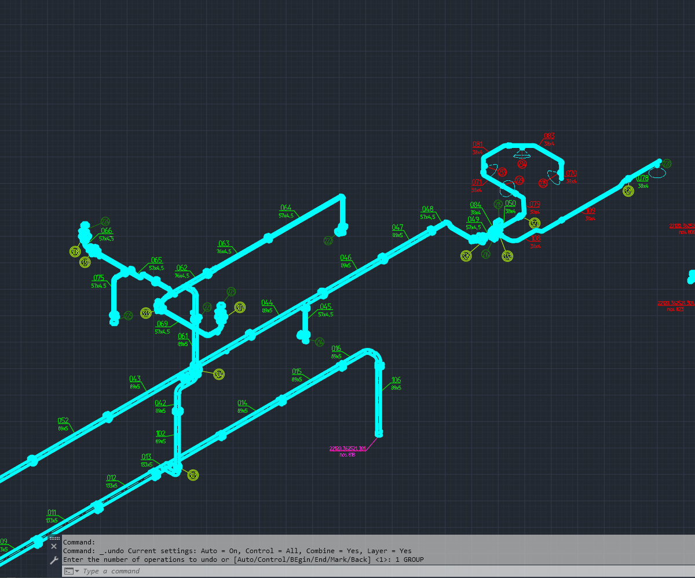

# 📐 AutoCAD AutoLISP — MLeaderSmartAlign

Smart geometry-aware alignment of AutoCAD `MULTILEADER` objects with live preview, iterative ordering, and optional perimeter distribution.

🇷🇺 [Русская версия](#-русская-версия)  
🇬🇧 [English version](#-english-version)

---

## 🎞 Latest demo — v0.7

[](images/MLeaderSmartAlign_v07.gif)

🎬 **YouTube — development + live AutoCAD test:**  
https://youtu.be/nRvsLB-oLcI

The video shows the v0.7 development process, including the ChatGPT-assisted generation of `MLeaderSmartAlign_v07.lsp`, followed by a real test of the command in AutoCAD.

### Previous demos

**MLeaderSmartAlign — line alignment**

[](images/example.gif)

**MLeaderSmartAlign Perimeter**

[](images/MLeaderSmartAlign_Perimeter.gif)

🎬 YouTube demo of the previous AutoCAD version:  
https://youtu.be/xIh3vYKc8fs

---

## 📦 Main file

`MLeaderSmartAlign_v07.lsp`

v0.7 is **standalone**. It no longer requires `MLeaderSmartAlign_v05.lsp` or the separate Perimeter companion file.

### Commands

```text
MSA7
MLEADERSMARTALIGN
```

Both commands launch the same v0.7 workflow.

---

# 🇷🇺 Русская версия

## 🚀 MLeaderSmartAlign v0.7

`MLeaderSmartAlign v0.7` объединяет два режима в одну интерактивную команду:

```text
LIVE LINE → click P2 → optional LIVE PERIMETER
```

🎬 Видео с процессом разработки v0.7 и проверкой команды в AutoCAD:  
https://youtu.be/nRvsLB-oLcI

В ролике показан сам процесс формирования `MLeaderSmartAlign_v07.lsp` с помощью ChatGPT, а затем реальная проверка команды в AutoCAD.

Теперь не нужно заранее выбирать между линейным выравниванием и распределением по периметру.

Сначала пользователь получает Live Preview обычного SmartAlign вдоль одной линии. После фиксации второй точки линейное распределение становится базовым результатом. Затем можно либо оставить его, либо продолжить движение курсора и перейти в Live Perimeter.

---

## 🖱 Как работает v0.7

1. Выполните `APPLOAD`.
2. Загрузите `MLeaderSmartAlign_v07.lsp`.
3. Запустите `MSA7` или `MLEADERSMARTALIGN`.
4. Выберите нужные `MULTILEADER`.
5. Укажите первую точку `P1`.
6. Двигайте курсор — MLeader в реальном времени распределяются вдоль линии `P1 → cursor`.
7. Кликните вторую точку `P2`.

После фиксации `P2` линейное распределение становится базовым:

```text
P1 ───────────────── P2
```

Дальше:

- `Esc` или правая кнопка мыши → оставить линейное распределение;
- движение курсора в сторону → перейти в **Live Perimeter**;
- клик по `P3` → зафиксировать распределение по периметру.

Если во время Perimeter Preview нажать `Esc`, команда возвращается к уже принятому линейному распределению `P1 → P2`.

---

## 🔲 Live Perimeter

После `P2` курсор задаёт третью точку:

```text
P1 → P2 → P3
```

Четвёртая вершина рассчитывается автоматически:

```text
P4 = P1 + (P3 - P2)
```

Получается динамический параллелограмм.

Две диагонали делят его на четыре области:

```text
P1-P2-C → сторона P1-P2
P2-P3-C → сторона P2-P3
P3-P4-C → сторона P3-P4
P4-P1-C → сторона P4-P1
```

Каждый MLeader классифицируется по **исходной representative Arrow Point**. Если Arrow Point попадает на границу или за пределы области, MLeader назначается ближайшей стороне.

После этого каждая из четырёх групп независимо обрабатывается тем же SmartAlign-алгоритмом.

---

## 🧠 Основной алгоритм SmartAlign

Алгоритм не выполняет одноразовую сортировку всех MLeader.

Для `N` элементов линия распределения делится на:

```text
N + 1
```

интервалов, а MLeader занимают внутренние точки.

Для каждой очередной Target Point заново анализируются **все оставшиеся MLeader**:

```text
N → выбрать → переместить

N - 1 → пересчитать оставшиеся → выбрать следующий

N - 2 → пересчитать снова

...

1
```

Для выбора используется геометрия между:

```text
Target Point → original Arrow Point
```

и направлением текущей стороны.

Такой подход согласует:

```text
порядок MLeader ↔ расположение их Arrow Points
```

и во многих типовых ситуациях уменьшает пересечения Leader Lines.

> Прямой pairwise-тест пересечения каждой пары Leader-сегментов не используется.

---

## 📝 Content-aware alignment

v0.7 сохраняет логику размещения из v0.5.

### MText

Используется горизонтальный центр текста, спроецированный на уровень landing. Это помогает равномерно распределять MText разной ширины и не смещать текст относительно его полки.

### Block / круглые позиции

Для блочного содержимого используется позиция блока, которая обычно соответствует визуальному центру круглой позиции.

### Fallback

Если тип содержимого определить не удалось, используется representative landing point.

---

## ↩️ Поведение Esc

В v0.7 отмена зависит от текущего этапа:

```text
до P2:
Esc → вернуть исходную геометрию

после P2:
Esc → оставить линейное распределение

во время Perimeter Preview:
Esc → вернуть линейное распределение P1-P2
```

Это позволяет использовать одну команду и для обычного линейного SmartAlign, и для Perimeter.

---

## ✅ Что нового в v0.7

- один standalone-файл;
- больше не требуется загружать `MLeaderSmartAlign_v05.lsp`;
- больше не требуется отдельный `MLeaderSmartAlign_Perimeter_v01_fix1.lsp`;
- линейный Live Preview и Perimeter объединены в один workflow;
- после `P2` линейный результат становится безопасной baseline-позицией;
- Live Perimeter начинается простым движением курсора в сторону;
- `Esc` во втором этапе возвращает линейный результат, а не исходную геометрию;
- сохранена content-aware логика для MText и блоков;
- сохранены исходные Arrowhead Points;
- сохранён итерационный алгоритм `N → N-1 → ... → 1`;
- добавлены команды `MSA7` и `MLEADERSMARTALIGN`.

---

## 📚 Предыдущие версии

### MLeaderSmartAlign v0.5

`MLeaderSmartAlign_v05.lsp` — отдельный режим линейного SmartAlign с Live Preview и content-aware размещением.

### MLeaderSmartAlign Perimeter v0.1

`MLeaderSmartAlign_Perimeter_v01_fix1.lsp` — отдельный режим распределения по четырём сторонам параллелограмма.

Команды:

```text
MSAP
MLeaderSmartAlignPerimeter
```

Perimeter v0.1 требует загрузки `MLeaderSmartAlign_v05.lsp`.

Эти файлы сохранены в репозитории как предыдущие стабильные версии и для сравнения алгоритма.

---

## 🧬 Откуда появился алгоритм

Идея выросла из более раннего VBA-проекта для CATIA V5 Drafting:

GitHub:  
https://github.com/ivashinpavel07/CATIA-V5-VBA-Align-Balloons

YouTube:  
https://youtu.be/UVtbpVKDkvY

В CATIA использовался тот же ключевой принцип: после размещения одного Balloon заново анализировать геометрию всех оставшихся кандидатов перед выбором следующего.

Затем алгоритм был перенесён в AutoCAD и дополнен ActiveX-доступом к `MULTILEADER`, Live Preview, сохранением исходных Arrowhead Points, content-aware размещением MText и блоков, распределением по периметру и единым интерактивным workflow в v0.7.

---

## 🧱 Структура репозитория

```text
AutoCAD-AutoLISP-MLeaderSmartAlign/
│
├── MLeaderSmartAlign_v07.lsp
├── MLeaderSmartAlign_v05.lsp
├── MLeaderSmartAlign_Perimeter_v01_fix1.lsp
├── README.md
├── CHANGELOG.md
├── RELEASE_NOTES_v0.5.md
├── LICENSE
│
└── images/
    ├── MLeaderSmartAlign_v07.gif
    ├── MLeaderSmartAlign_Perimeter.gif
    └── example.gif
```

---

## ⚠️ Ограничения

- алгоритм не выполняет прямой геометрический тест пересечения каждой пары Leader-сегментов;
- при нескольких Leader Lines используется representative / averaged Arrow Point;
- Live Preview на `grread` не воспроизводит полностью штатные OSNAP / Polar / Ortho tracking;
- решение рассчитано на AutoCAD for Windows с Visual LISP / ActiveX;
- на очень сложной геометрии после автоматического размещения может потребоваться ручная корректировка.

---

## 📄 Лицензия

MIT License.

---

# 🇬🇧 English version

## 🚀 MLeaderSmartAlign v0.7

`MLeaderSmartAlign v0.7` combines line alignment and perimeter distribution into one interactive command:

```text
LIVE LINE → click P2 → optional LIVE PERIMETER
```

🎬 Video showing the v0.7 development process and a real AutoCAD test:  
https://youtu.be/nRvsLB-oLcI

The video includes the ChatGPT-assisted creation of `MLeaderSmartAlign_v07.lsp`, followed by testing the command directly in AutoCAD.

You no longer have to choose a separate command before starting.

The workflow begins with the normal SmartAlign Live Preview along a line. After the second point is fixed, that linear layout becomes the baseline result. From there, you can either keep the line alignment or continue moving the cursor sideways to enter Live Perimeter mode.

---

## 🖱 How v0.7 works

1. Run `APPLOAD`.
2. Load `MLeaderSmartAlign_v07.lsp`.
3. Run `MSA7` or `MLEADERSMARTALIGN`.
4. Select the required `MULTILEADER` objects.
5. Pick the first point `P1`.
6. Move the cursor — the MLeaders are redistributed in real time along `P1 → cursor`.
7. Click the second point `P2`.

After `P2` is fixed, the linear layout becomes the baseline:

```text
P1 ───────────────── P2
```

Then:

- `Esc` or right-click → keep the linear layout;
- move the cursor sideways → enter **Live Perimeter**;
- click `P3` → accept the perimeter layout.

If `Esc` is pressed during Perimeter Preview, the command returns to the already accepted `P1 → P2` linear layout.

---

## 🔲 Live Perimeter

After `P2`, the cursor defines the third point:

```text
P1 → P2 → P3
```

The fourth vertex is calculated automatically:

```text
P4 = P1 + (P3 - P2)
```

This creates a dynamic parallelogram.

Two diagonals divide it into four regions:

```text
P1-P2-C → side P1-P2
P2-P3-C → side P2-P3
P3-P4-C → side P3-P4
P4-P1-C → side P4-P1
```

Each MLeader is classified using its **original representative Arrow Point**. Boundary or outside points are assigned to the nearest perimeter side.

Each side group is then processed independently with the same SmartAlign algorithm.

---

## 🧠 SmartAlign algorithm

The algorithm does not perform a one-time sort of all MLeaders.

For `N` objects, the distribution line is divided into:

```text
N + 1
```

intervals and the MLeaders occupy the internal target points.

For every Target Point, **all remaining MLeaders are evaluated again**:

```text
N → select → move

N - 1 → recalculate remaining candidates → select next

N - 2 → recalculate again

...

1
```

The selection is based on the geometry between:

```text
Target Point → original Arrow Point
```

and the current alignment direction.

This coordinates:

```text
MLeader order ↔ Arrow Point geometry
```

and can reduce crossing Leader Lines in many typical drawing layouts.

> The algorithm does not explicitly test every pair of Leader segments for intersection.

---

## 📝 Content-aware alignment

v0.7 preserves the content-aware placement strategy introduced in v0.5.

### MText

The horizontal text center is projected onto the landing level. This provides more even spacing for MText of different widths while preserving the correct landing level.

### Block / circular callouts

Block content uses the block content position, which usually corresponds to the visual center of a circular callout.

### Fallback

If the content type cannot be resolved, the representative landing point is used.

---

## ↩️ Esc behavior

Cancellation now depends on the current stage:

```text
before P2:
Esc → restore original geometry

after P2:
Esc → keep the linear layout

during Perimeter Preview:
Esc → return to the P1-P2 linear layout
```

This allows one command to cover both line SmartAlign and Perimeter workflows.

---

## ✅ What's new in v0.7

- one standalone file;
- no dependency on `MLeaderSmartAlign_v05.lsp`;
- no dependency on the separate `MLeaderSmartAlign_Perimeter_v01_fix1.lsp`;
- line Live Preview and Perimeter combined into one workflow;
- the accepted P1-P2 line becomes a safe baseline;
- moving the cursor sideways starts Live Perimeter;
- `Esc` in stage 2 returns to the linear result instead of the original layout;
- content-aware MText / block placement preserved;
- original Arrowhead Points preserved;
- iterative `N → N-1 → ... → 1` algorithm preserved;
- commands `MSA7` and `MLEADERSMARTALIGN`.

---

## 📚 Previous versions

### MLeaderSmartAlign v0.5

`MLeaderSmartAlign_v05.lsp` — separate line-alignment mode with Live Preview and content-aware placement.

### MLeaderSmartAlign Perimeter v0.1

`MLeaderSmartAlign_Perimeter_v01_fix1.lsp` — separate four-side parallelogram distribution mode.

Commands:

```text
MSAP
MLeaderSmartAlignPerimeter
```

Perimeter v0.1 requires `MLeaderSmartAlign_v05.lsp`.

These files remain in the repository as previous stable versions and for algorithm comparison.

---

## 🧬 Origin of the algorithm

The original idea came from an earlier VBA project for CATIA V5 Drafting:

GitHub:  
https://github.com/ivashinpavel07/CATIA-V5-VBA-Align-Balloons

YouTube:  
https://youtu.be/UVtbpVKDkvY

The CATIA version already used the same key principle: after placing one Balloon, recalculate the geometry of all remaining candidates before selecting the next one.

The AutoCAD implementation later added ActiveX access to `MULTILEADER`, Live Preview, original Arrowhead preservation, content-aware MText and block placement, perimeter distribution, and the unified interactive v0.7 workflow.

---

## 🧱 Repository structure

```text
AutoCAD-AutoLISP-MLeaderSmartAlign/
│
├── MLeaderSmartAlign_v07.lsp
├── MLeaderSmartAlign_v05.lsp
├── MLeaderSmartAlign_Perimeter_v01_fix1.lsp
├── README.md
├── CHANGELOG.md
├── RELEASE_NOTES_v0.5.md
├── LICENSE
│
└── images/
    ├── MLeaderSmartAlign_v07.gif
    ├── MLeaderSmartAlign_Perimeter.gif
    └── example.gif
```

---

## ⚠️ Current limitations

- no explicit pairwise geometric intersection test is performed for all Leader segments;
- multiple Leader Lines are represented by a representative / averaged Arrow Point;
- `grread` Live Preview does not reproduce all native OSNAP / Polar / Ortho tracking features;
- intended for AutoCAD for Windows with Visual LISP / ActiveX;
- very complex geometry may still require minor manual adjustment.

---

## 📄 License

MIT License.
